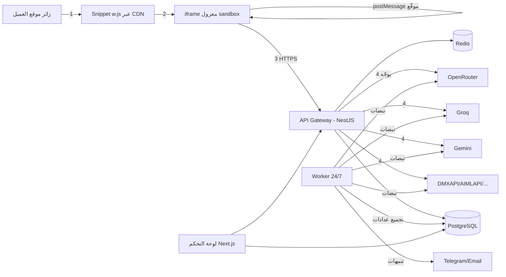
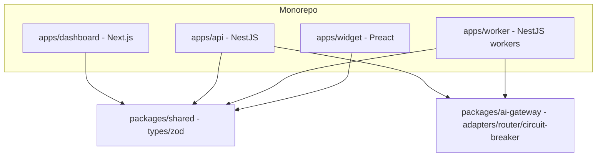
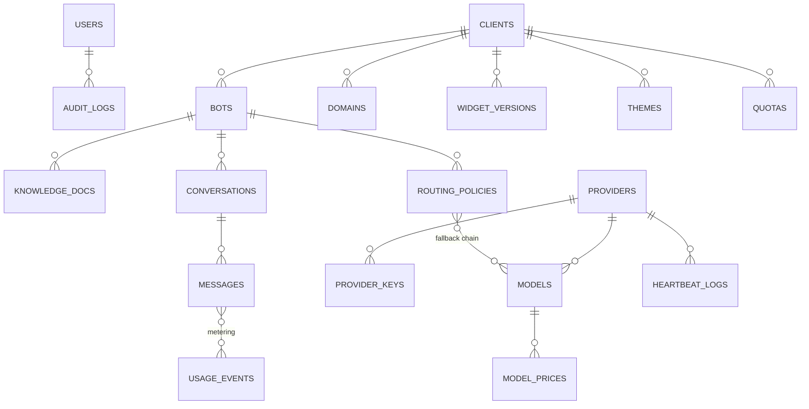

# 🏗️ المعمارية التقنية — Chat Bot Dev

> القرارات التقنية، تصميم النظام، نموذج البيانات، بروتوكول الودجت الآمن، وخطة النشر.

---

## 1. اختيار التقنية (والأسباب)

| الطبقة | الاختيار | لماذا |
|---|---|---|
| اللغة | **TypeScript بالكامل** (strict mode) | لغة واحدة للوحة + الخادم + العامل + الودجت = أنواع مشتركة (packages/shared) تمنع أخطاء العقود بين الطبقات |
| Monorepo | **pnpm workspaces + Turborepo** | عزل الخدمات مع إعادة استخدام كود، بناء متوازٍ سريع |
| لوحة التحكم | **Next.js 15 (App Router) + React 19 + Tailwind v4 + shadcn/ui + TanStack Query + Zustand** | RSC للأداء، دعم RTL ممتاز، نظام مكونات جاهز، SSR مفيد لصفحات التقارير |
| خدمة API | **NestJS 11 (Fastify adapter) + Prisma + ioredis + BullMQ** | معمارية وحدات (Modules/Guards/Interceptors) مثالية للتعددية المستأجرة، جاهزية REST + WebSocket |
| العامل الخلفي | **نفس كود NestJS بعملية منفصلة** (Queue Workers + Schedulers) | قاعدة كود واحدة، عمليات منفصلة: `api` و `worker` |
| الودجت | **TypeScript + Preact (≈4KB) + Vite** → ملف IIFE واحد ~45KB gz | حجم صغير، بدون تبعيات في صفحة العميل، Shadow DOM + iframe معزول |
| قاعدة البيانات | **PostgreSQL 16 + Redis 7** | علاقاتية للمعاملات (عملاء/بوتات/فوترة)، Redis للعدادات/الطوابير/pub-sub/TTL النبضات |
| الطوابير | **BullMQ (Redis)** | مهام مجدولة موثوقة + إعادة محاولة + جدولة cron داخل العامل |
| CDN للودجت | **Cloudflare R2 + CDN** | ملف ودجت + إعداد ثيم JSON لكل عميل بزمن استجابة منخفض عالمياً |
| المراقبة | **OpenTelemetry + Prometheus + Grafana + Loki + Sentry** | مقاييس/لوغات/أخطاء مركزية |
| النشر | **Docker + Traefik** على VPS (مرحلة أولى) → جاهزية Kubernetes (لاحقاً) | تكلفة منخفضة + مسار ترقية واضح |

### لماذا لا Next.js للـ API الخلفي؟
حجم أعمال المنصة (طوابير، نبضات 24/7، WS، تعددية مستأجرة عميقة) يحتاج خدمة منفصلة العمر الافتراضي عن الواجهة — فصل `api` عن `dashboard` يعني: نشر مستقل، توسع مستقل، وإعادة تشغيل اللوحة لا توقف البوتات.

---

## 2. مخطط النظام





### نطاقات الخدمة (Topology)
| النطاق | الغرض |
|---|---|
| `app.chatbotdev.app` | لوحة التحكم |
| `api.chatbotdev.app` | REST + WebSocket للوحة وللودجت |
| `widget.chatbotdev.app` | ملف الودجت + إطار المحادثة + إعدادات العميل |
| `cdn.chatbotdev.app` | نسخة CDN للأصول الثابتة |

---

## 3. بوابة الذكاء الاصطناعي (AI Gateway) — التصميم التفصيلي

### 3.1 نمط المحوّل (Adapter Pattern)
```ts
interface ProviderAdapter {
  kind: 'openai-compatible' | 'gemini-native';
  chat(req: ChatRequest): AsyncIterable<ChatChunk>;      // بث SSE
  chatBlocking(req: ChatRequest): Promise<ChatResponse>;
  listModels(): Promise<ModelInfo[]>;
  checkHealth(): Promise<HealthInfo>;                    // للنبضات
}
```
- **OpenAICompatibleAdapter:** يُبنى من (baseUrl + apiKey) فقط — يغطي OpenRouter، Groq، DeepSeek، Together، Cerebras، NVIDIA، Mistral، DMXAPI، AIMLAPI، SiliconFlow، SambaNova… (كل كتالوجنا تقريباً).
- **GeminiNativeAdapter:** يستخدم `generativelanguage.googleapis.com` بصيغته الأصلية (لأنه غير OpenAI-compatible).
- إضافة مزود جديد = صف جديد في جدول `providers` بلا أي كود.

### 3.2 محرك التوجيه (Router)
كل بوت له `routing_policy`:
```
routing_policy = {
  strategy: 'priority-failover' | 'weighted-round-robin' | 'least-latency' | 'cheapest-first' | 'smart-auto',
  tiers: [                    // سلسلة النماذج مرتبة
    { model: 'claude-4.1',   providers: [candidates...], fallback: true },
    { model: 'llama-3.3-70b', providers: [...] , fallback: true },
    { model: 'free-emergency', providers: [...] , fallback: false },
  ]
}
```
**خطوات التوجيه لكل رسالة:**
1. افحص صحة المرشحين (Circuit state + نبضة حديثة + Quota Headroom + زمن استجابة EWMA).
2. اختر وفق الاستراتيجية (score مركّب في smart-auto: `0.4·health + 0.25·(1/latency) + 0.2·cost + 0.15·quota`).
3. أرسل مع مهلة TTFT تكيفية + رصد ترويسات rate-limit.
4. عند فشل/تجاوز مهلة → انتقل للمرشح التالي في نفس الطبقة، ثم الطبقة التالية (كل طبقة تصعيد أقل تكلفة أو أقل جودة حسب الترتيب).
5. سجّل الحدث الكامل للعدادات (أي مرشح خدم الطلب).

### 3.3 دائرة الكسر (Circuit Breaker)
حالة لكل `(provider, model)` في Redis:
```
CLOSED ──(error_rate>50% في 120s أو 5 فشل متتالٍ)──▶ OPEN (cooldown تصاعدي 10s→5min)
OPEN ──(انتهاء cooldown)──▶ HALF_OPEN ──(رسالة فحص نجحت)──▶ CLOSED
                                 └──(فشلت)──▶ OPEN
```
- حالات 429 لا "تفتح" الدائرة وحدها — بل تُخصم من Quota Headroom وتُعالج كإشارة إشباع.
- كل انتقال حالة → حدث تدقيق + مقياس Prometheus.

### 3.4 النبضات (Heartbeats) — تشغيل دائم 24/7
- **العامل (Worker)** عملية مستقلة تحت supervisor بـ `restart: always`، تبدأ تلقائياً مع النظام.
- جدولة BullMQ متكررة: نبضة لكل مزود نشط كل 30–120ث (قابلة للضبط): استدعاء `/models` أو رسالة "ping" مصغّرة (بتكلفة ~0).
- كل نبضة: كتابة `heartbeat_logs` + `SETEX provider:pulse:{id} 300` في Redis.
- **Dead-Man Switch:** مهمة أخرى كل دقيقة تفحص مفاتيح النبض: مفتاح مفقود/منتهي ⇒ الخدمة ميتة ⇒ تنبيه فوري.
- نفس آلية TTL تراقب **العامل نفسه** (نبضة العامل يكتبها ويجددها، وUptime Kuma خارجي يفحص `/healthz`).
- النتيجة: حتى لو اللوحة مغلقة أو الـ API معاد تشغيله، العدادات والتنقّل والنبضات تستمر.

### 3.5 العدادات (Metering Pipeline)
```
رسالة مكتملة ─▶ api يكتب event فوري في Redis Stream (usage:events)
Worker يستهلك الدفق ─▶ يجمّع Redis counters (يوم/شهر × bot × provider)
Worker كل ساعة ─▶ rollup إلى usage_hourly / usage_daily في PostgreSQL
مهمة يومية ─▶ Reconciliation مع مزودين يدعمون /usage + تنبيه انحراف > 0.5%
```

### 3.6 حماية الحدود (Quota & Fairness)
- جدول `provider_limits`: حدود معروفة لكل مزود (RPM/TPM/يومية) — يُحدَّث من بيانات المجتمع والاختبار.
- قراءة `x-ratelimit-remaining` الحية إن وفرها المزود (Groq/OpenRouter توفرها).
- **Shedding استباقي:** عند بقاء <15% من الحصة يبدأ التوجيه بتفضيل البدائل قبل الوصول لصفر.
- حدود الزائر: token bucket (جلسة + IP) عبر Redis.
- حدود العميل: يومية/شهرية من الباقة + سلوك عند النفاد (رسالة اعتذار / تحويل لمجاني / إيقاف).

---

## 4. الودجت (Widget) — التصميم الآمن

### 4.1 المقتطف (Snippet)
```html
<!-- Chat Bot Dev -->
<script src="https://widget.chatbotdev.app/w.js?id=elshawwa&v=2" async defer></script>
```
- 5 كيلوبايت فقط: يحقن `<iframe sandbox>` داخل Shadow DOM لمنع أي تعارض CSS/JS مع موقع العميل.
- `async` = لا يؤثر على تحميل الموقع أبداً.

### 4.2 بروتوكول العزل والأمان
| الطبقة | الآلية |
|---|---|
| عزل بصري | Shadow DOM + iframe بمسار منفصل (widget.chatbotdev.app) |
| عزل صلاحيات | `sandbox="allow-scripts allow-forms"` (بلا same-origin) — لا وصول لـ cookies/DOM الخاص بالعميل |
| عزل شبكة | CSP صارم على الإطار + `frame-ancestors` للدومين المسموح فقط |
| اتصال آمن | postMessage ثنائي مع: تحقق Origin، nonce handshake، توقيع HMAC |
| سياق الصفحة | الزائر يرسل (path, title, meta) فقط — لا بيانات حساسة |
| الجلسة | token قصير (5 دقائق) موقّع + تجديد تلقائي + visitor_id في localStorage |
| النطاق | الخادم يتحقق Origin/Referer ضد allowlist العميل (يُسجَّل الانتهاك) |
| سلامة الملف | SRI hash في المقتطف + توقيع إصدارات الودجت |

### 4.3 سياق الصفحة (Page-Aware Interaction)
- الودجت يرسل المسار الحالي (مثلاً CS-Cart: `/bedding/bed/`) للبوت في كل رسالة.
- البوت يستخدمه مع معرفته (منتجات/سياسات) ليرد بما يناسب المكان: صفحة منتج → تفاصيل المنتج؛ صفحة شحن → سياسة الشحن… إلخ.
- يدعم أيضاً `data-page` يدوي من العميل للمنصات ذات المسارات الديناميكية.

### 4.4 الثيم (Theme Pipeline)
```
لوحة التحكم: Theme Editor (ألوان/مواضع/نصوص) ─▶ يحفظ theme JSON ─▶ ينشر لـ R2
الودجت عند التحميل: يجلب config العميل (موقّع، cached 5 دقائق) ─▶ يطبق CSS variables
```

---

## 5. نموذج البيانات (الكيانات الأساسية)



**جداول رئيسية:** `users, roles, clients, domains_allowlist, themes, widget_versions, bots, bot_versions, knowledge_docs, knowledge_chunks, routing_policies, providers, provider_keys(encrypted), models, model_prices, heartbeat_logs, conversations, messages, usage_events, usage_hourly, usage_daily, quotas, plans, alerts, audit_logs, webhooks`.

**قواعد التعددية المستأجرة:** كل جدول أعمال يحمل `client_id` + فهارس مركبة + طبقة حماية في الاستعلامات (Prisma middleware) تمنع تسريب بيانات بين العملاء.

---

## 6. واجهة API (الملخص)

| المجموعة | نقاط النهاية الرئيسية |
|---|---|
| Auth | `POST /auth/login` `POST /auth/refresh` `POST /auth/2fa` |
| Clients | `CRUD /clients` + `PUT /clients/:id/brand` + `PUT /clients/:id/domains` |
| Bots | `CRUD /bots` `PUT /bots/:id/persona` `POST /bots/:id/knowledge` `PUT /bots/:id/routing` |
| Themes | `GET/PUT /clients/:id/theme` `GET /clients/:id/snippet` |
| Providers | `CRUD /providers` `POST /providers/:id/test` `POST /providers/:id/refresh-models` |
| Status | `GET /status/heartbeats` `GET /status/circuits` `GET /w/healthz` |
| Usage | `GET /usage/summary` `GET /usage/series` `GET /usage/reconciliation` `GET /usage/unanswered` `POST /usage/unanswered/:id/resolve` |
| Conversations | `GET /conversations` `GET /conversations/:id` `POST /conversations/:id/reply` |
| Widget (عام) | `GET /w/config/:client` `POST /w/session` `POST /w/chat` (SSE) `POST /w/feedback` `POST /w/lead` `POST /w/handoff` `POST /w/order` |
| Webhooks (صادر) | `GET/POST /clients/:id/webhooks` `PATCH/DELETE …/:id` `POST …/:id/test` `POST …/:id/reveal` `GET …/:id/deliveries` `POST …/deliveries/:deliveryId/retry` |

### 6.1 محرك Webhooks الصادرة (الموثوقية أولاً)

- **الإيداع Fire-and-Forget**: كل حدث (lead/رسالة/تحويل/تتبع طلب/مزامنة كتالوج) يُكتب في جدول `webhook_deliveries` فوراً ولا يمس زمن رد الودجت إطلاقاً.
- **معالجة دورية** (كل 15 ثانية + kick فوري عند الإيداع) بادّعاء متفائل: `UPDATE … WHERE id = ? AND status IN (…) AND next_attempt_at <= ?` — آمن حتى مع عاملين، مع **استعادة الصفوف العالقة في `sending`** بعد انهيار عملية (سلامة ضد الأعطال).
- **إعادة المحاولة بتراجع أسي**: 30ث → 2د → 10د → 1س → 6س (حتى 5 محاولات) ثم `dead` مع سجل أخطاء كامل.
- **التوقيع**: `X-CBD-Signature: sha256=HMAC(secret, "{ts}.{body}")` + `X-CBD-Signature-Timestamp` — يتحقق منه Zapier/Sheets برمجياً.
- **الأمان**: حماية SSRF (منع العناوين الخاصة في الإنتاج عبر `WEBHOOK_ALLOW_PRIVATE=false`) + مهلة 8 ثوانٍ + سقف 256KB للرزمة + سر يُكشف فقط بطلب مُدقَّق.
- **الأحداث**: `lead.created` · `conversation.message` · `handoff.requested` · `order.tracked` · `catalog.synced` · `webhook.test`.

### 6.2 الأسئلة غير المجابة

عند استخدام الرد الاحتياطي (فشل/انقطاع النموذج) يُسجَّل السؤال بتطبيع عربي (تشكيل/همزات/ألفويات) في `unanswered_questions` بعدّاد تكرار — لتغذية قاعدة المعرفة من صفحة الاستهلاك.

- توثيق OpenAPI تلقائي (Swagger) — إصدارات API (`/v1`).
- WebSocket للوحة: تحديثات حية للنبضات والعدادات (Socket.IO namespaces لكل دور).

---

## 7. البيئات والنشر (Deployment)

| البيئة | البنية | الغرض |
|---|---|---|
| **Dev** | Docker Compose محلي (postgres, redis, api, worker, dashboard, traefik) | التطوير |
| **Staging** | VPS صغير (نفس صورة الإنتاج) | اختبار قبل النشر |
| **Production (Phase 1)** | **VPS واحد 4vCPU/8GB** (Hetzner/DO) + Traefik + Postgres/Redis بنفس الجهاز + R2 للأصول | تشغيل حتى ~50 عميل |
| **Production (Phase 2)** | Managed Postgres + Redis مستقل + API بعقدتين + Worker مستقل | >50 عميل / >100K حدث/يوم |

- **CI/CD:** GitHub Actions → build/test → صورة Docker موحدة → نشر صفر-توقف (Blue/Green بسيط مع Traefik).
- **النسخ الاحتياطي:** `pg_dump` يومي + نسخ R2 + احتفاظ 30 يوم + اختبار استعادة شهري.
- **الأسرار:** ملف `.env` مشفر (sops/age) + مفاتيح API للعملاء في DB مشفرة بمفتاح KMS.

### تقدير تكلفة المرحلة الأولى
| البند | التكلفة الشهرية التقريبية |
|---|---|
| VPS 4vCPU/8GB | ~20–25$ |
| Cloudflare R2 + CDN | ~1–5$ |
| Sentry / Grafana Cloud free | 0$ |
| نطاقات | ~2$ |
| **الإجمالي** | **~30$** + استهلاك نماذج مدفوع (يُدار بالعدادات والوضع الاقتصادي) |

---

## 8. مصفوفة الضوابط الأمنية

| الضابط | التنفيذ |
|---|---|
| المصادقة | Argon2id + JWT قصير + Refresh دوّار + TOTP 2FA + قفل بعد محاولات |
| التفويض | RBAC + Casl policies + تدقيق كل فعل |
| الأسرار | AES-256-GCM بملح لكل مفتاح + KMS خارجي لاحقاً + منع الظهور في اللوغات (redaction) |
| النقل | TLS 1.2+، HSTS، ترقيات تلقائية |
| التطبيق | Zod validation لكل مدخل، Helmet، CSRF، CORS allowlist صارم |
| الحدود | نافذة منزلقة Redis لكل: IP، جلسة، عميل، مزود |
| المحتوى | فلتر حقن، فلتر مخرجات، سقف طول، سياسة عميل |
| البيانات | تقليل PII، IP مجزأ، احتفاظ محدد، حذف آلي للمحادثات القديمة |
| التدقيق | Audit Log غير قابل للتعديل + تتبع التغييرات الحرجة |

---

## 9. الاختبارات

- **وحدات:** packages/ai-gateway (router, circuit breaker, metering) تغطية ≥ 85%.
- **تكامل:** وهميات مزودين (mock OpenAI-compatible servers) تحاكي: تأخير، 429، 500، قطع بث.
- **حمل:** k6 — 500 محادثة متزامنة عبر البوابة مع قياس TTFT.
- **أمان:** فحص ZAP دوري + اختبار اختراق خارجي قبل v1.0.

---

## 10. قرارات مؤجلة صراحةً (ADRs)

| القرار | التأجيل لـ | البديل الحالي |
|---|---|---|
| Kubernetes | عند >100K حدث/يوم | Docker Compose + VPS |
| ClickHouse للتحليلات | عند >5M رسالة/شهر | PostgreSQL + rollups |
| Vector DB مخصص (pgvector كافٍ) | عند >100K chunk | pgvector داخل Postgres |
| فوترة مالية آلية | v1.x بعد ثبات المنتج | عدادات + تقارير يدوية |
